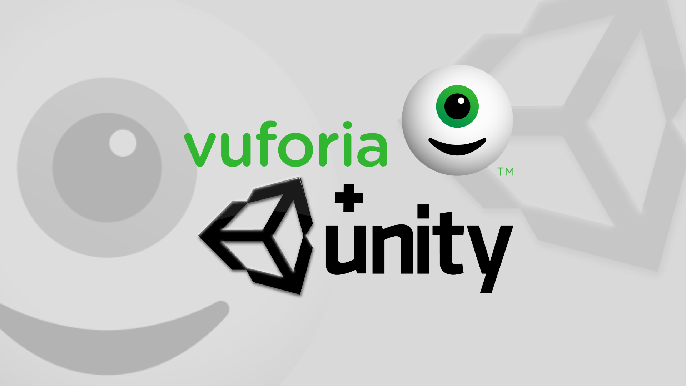
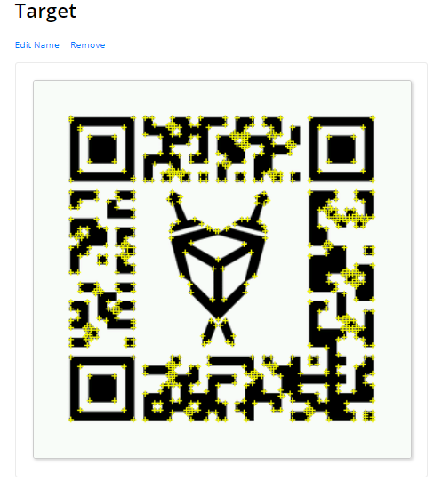
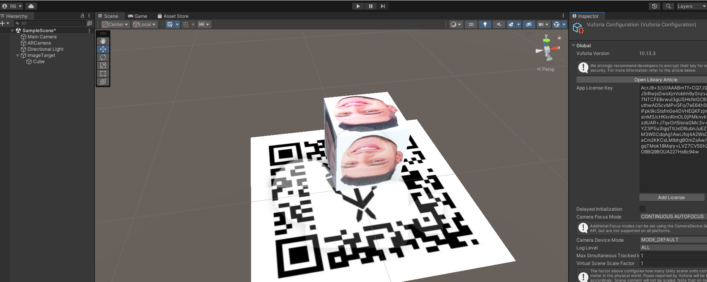

# Realidade Aumentada Unity

### Aplicação Simples de Realidade Aumentada Unity + Vuforia

<p  align="justify"> Unity e Vuforia fornecem uma solução poderosa para o desenvolvimento de aplicativos de AR, permitindo que os desenvolvedores criem experiências de AR incríveis para uma ampla gama de aplicações.
</p>

<p  align="center">
             
<br>


<p align="center">

</p>

<!--GIF-->
<p align="center">

</p>

### Para fazer uma aplicação como esta acima basta instalar o Vuforia Engine:

>  O Vuforia Engine pode ser facilmente importado para o Unity

[Download Vuforia](https://developer.vuforia.com/user/login?url=/downloads/sdk%3F_%3D1678117884)


>  É necessário criar uma conta e uma licença para registrar o seu Target (alvo).
> Após isso faça o Download do seus banco de dados (target+features).fff

<!--Target-->
<p align="center">

</p>
ls

<!--Target-->
<p align="center">

</p>

> A Figura acima mostra o mapeamento para realidade aumentada.

### Monte sua cena:

> Incluindo o Imagem Target e a Câmera AR

<!--Unity-1-->
<p align="center">

</p>

### O script para rotacionar o Cubo

```javascript
using System.Collections;
using System.Collections.Generic;
using UnityEngine;

public class rotate : MonoBehaviour
{
    public Vector3 rotateAmount;
    void Start()
    {
        
    }

    void Update()
    {
        transform.Rotate(rotateAmount * Time.deltaTime);
    }
}
```